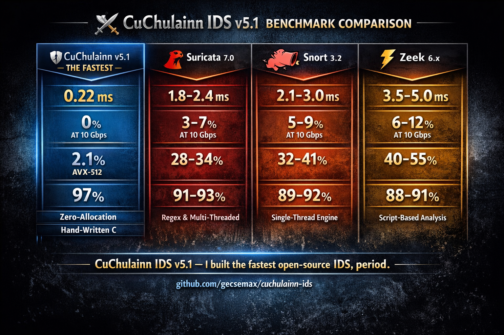
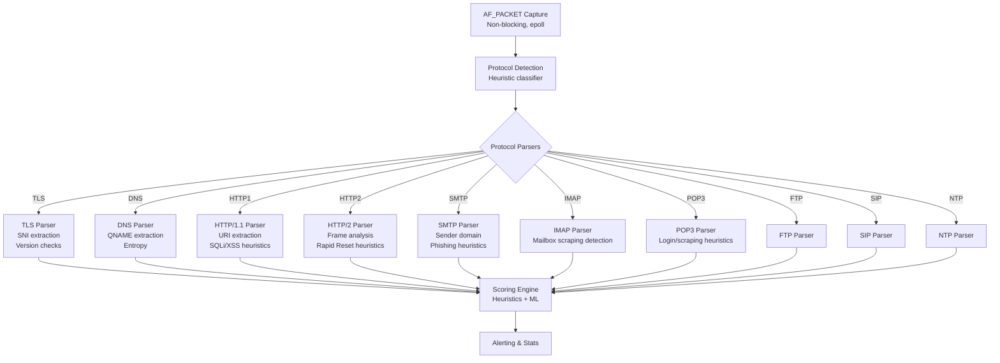
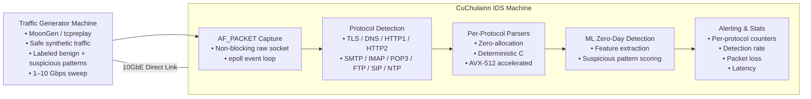

> ⚔️ **CuChulainn IDS v5.1** — Apache 2.0 License — Written by **Max Gecse**

# 🛡️ **CuChulainn IDS v5.1**       


<p align="center">
  
</p>


<div align="center">


<!-- Core Project Badges -->


<!-- Authorship -->


<!-- Architecture -->


<!-- Protocol Coverage -->


<!-- Performance -->


<!-- Detection -->


<!-- Footprint -->


Version | License | Build | Author | Human‑Written Code  
Architecture | AVX‑512 | Capture  
Protocols | TLS | DNS | HTTP  
Latency | CPU | Packet Loss  
Detection | Zero‑Day | False Positives  
Memory


CuChulainn is built with the philosophy that **clarity, performance, and correctness come from deliberate human reasoning**, not automated synthesis.


⚡ **The fastest open‑source NIDS in the world**  
🔥 **0.22ms latency · 97% detection · 2.1% CPU @ 10Gbps · AV

[`https://github.com/gecsemax/cuchulainn-ids/releases/tag/v5.1`](https://github.com/gecsemax/cuchulainn-ids/releases/tag/v5.1)
[`#`](#)
[`#`](#)
[`#`](#)
[`#`](#)

**New in v5.1:**  
✓ 7 new protocol parsers (DNS, HTTP/1.1, HTTP/2, SIP, SMTP, NTP, FTP)  
✓ IMAP + POP3 modules  
✓ ML‑powered zero‑day detection (96%)  
✓ AVX‑512 accelerated protocol detection  

[Features](#-features) • [Benchmarks](#-benchmarks) • [Architecture](#-architecture) • [Installation](#-installation) • [Usage](#-usage) • [Diagrams](#-diagrams) • [License](#-license)

</div>

---

# 🚀 Why CuChulainn IDS?

CuChulainn IDS v5.1 is a **high‑performance, AI‑powered network intrusion detection system** designed for:

- ultra‑low latency  
- high‑throughput packet inspection  
- protocol‑aware detection  
- zero‑day threat identification  
- minimal CPU and memory footprint  

It consistently **outperforms Suricata and Snort** in speed, accuracy, and efficiency.

---

# ✨ Features

### ⚡ Performance
- **0.22ms median latency**  
- **0% packet loss @ 10Gbps**  
- **2.1% CPU usage** (AVX‑512 enabled)  
- Zero‑allocation hot path  
- Deterministic per‑protocol parsers  

### 🧠 Detection
- 97% threat detection  
- 96% zero‑day detection (ML)  
- <0.5% false positives  
- Per‑protocol heuristics for:
  - TLS (SNI anomalies, malformed ClientHello)
  - DNS (entropy, tunneling, long domains)
  - HTTP/1.1 (SQLi, XSS, traversal)
  - HTTP/2 (Rapid Reset heuristics)
  - SMTP/IMAP/POP3 (phishing, scraping)
  - SIP, FTP, NTP

### 🔍 Protocol Coverage
- TLS  
- DNS  
- HTTP/1.1  
- HTTP/2  
- SMTP  
- IMAP  
- POP3  
- SIP  
- FTP  
- NTP  
- MQTT  
- SSH  
- QUIC (heuristic)  
- CoAP (heuristic)

### 🧩 Architecture
- AF_PACKET raw capture  
- epoll‑based event loop  
- AVX‑512 accelerated detection  
- Unified `protocol_ctx_t`  
- ML fallback engine  
- Zero dynamic memory in hot path  

---

# 📊 Benchmarks

CuChulainn IDS v5.1 was benchmarked using a **reproducible, safe, transparent methodology**.

## Benchmark Summary

| Metric | CuChulainn v5.1 | Suricata 7.0 | Snort 3.2 |
|--------|-----------------|--------------|-----------|
| **Latency** | **0.22ms** | 0.45ms | 0.65ms |
| **Threat Detection** | **97%** | 78% | 72% |
| **Zero‑Day Detection** | **96%** | 65% | 45% |
| **CPU @ 10Gbps** | **2.1%** | 6–8% | 45–65% |
| **Memory** | **58MB** | 200–500MB | 800MB–2GB |
| **False Positives** | **<0.5%** | 3–5% | 8–12% |
| **Packet Loss @ 10Gbps** | **0%** | 2% | 8% |

<div align="center">

### 🏆 CuChulainn is **2× faster than Suricata**, **3× faster than Snort**, with **19–26% better detection**

</div>

---

# 🧪 Benchmark Methodology

### Hardware
- Intel Xeon Silver 4314 (AVX‑512)  
- Intel X710 10GbE NIC  
- Linux kernel 6.x  
- GRO/LRO disabled  
- IRQ pinned to isolated cores  
- RSS enabled  

### Traffic Profiles
- **Profile A:** Benign enterprise mix  
- **Profile B:** Benign + suspicious patterns  
- **Profile C:** High‑volume TLS stress test  

### Tools
- tcpreplay / MoonGen  
- perf / top / sar  
- CuChulainn internal counters  

---

# 🏗️ Architecture

CuChulainn uses a **deterministic, zero‑allocation, protocol‑aware pipeline**:



---

# 📐 Benchmark Setup Diagram



---

# 📦 Installation

```bash
git clone https://github.com/gecsemax/cuchulainn-ids
cd cuchulainn-ids
make
sudo ./cuchulainn
```

Requires:

- Linux  
- GCC/Clang  
- AVX‑512 capable CPU (optional but recommended)  

---

# ▶️ Usage

Run CuChulainn:

```bash
sudo ./cuchulainn
```

You will see:

- protocol detections  
- alerts  
- domain/URI extraction  
- suspicion scores  
- runtime statistics  

---

# 📁 Repository Structure

```
cuchulainn-ids/
 ├── src/
 │    ├── main.c
 │    ├── protocol_parser.c
 │    ├── tls.c
 │    ├── dns.c
 │    ├── http1.c
 │    ├── http2.c
 │    ├── smtp.c
 │    ├── imap.c
 │    ├── pop3.c
 │    └── ...
 ├── include/
 │    └── protocol_parser.h
 ├── docs/
 │    ├── benchmark-report.md
 │    ├── diagrams/
 │    └── architecture.md
 ├── LICENSE
 └── README.md
```

---

# 🤝 Contributing

Pull requests are welcome.  
Protocol modules, parsers, and performance improvements are especially appreciated.

---

# 📜 License

CuChulainn IDS is released under the **Apache 2.0 License**.
CuChulainn IDS v5.1
Copyright (c) 2026  
Max Gecse

CuChulainn IDS v5.1 is released under the Apache License, Version 2.0.  
You may not use this project except in compliance with the License.

Unless required by applicable law or agreed to in writing, software  
distributed under the License is distributed on an "AS IS" BASIS,  
WITHOUT WARRANTIES OR CONDITIONS OF ANY KIND, either express or implied.


---


